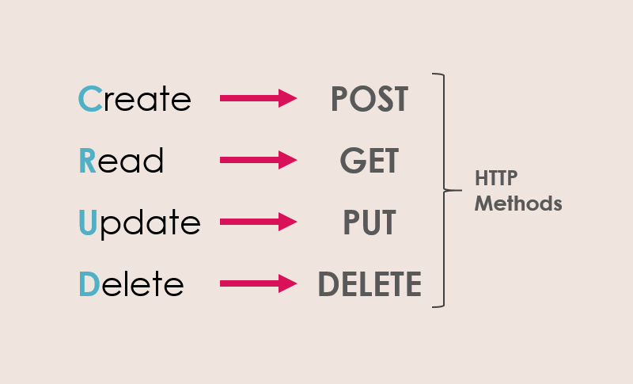

### 📝 FastAPI Project Setup

#### 🛠️ Step 1: Virtual Environment
First, keep your project organized by creating a virtual environment.

> python3 -m venv myenv

#### ⚡ Step 2: Activate the Environment
Turn on your environment so you can install packages.

> source ./myenv/bin/activate

---
### Decorator in Python
```
def my_decorator(func):
    def wrapper():
        print("******************")
        func()
        print("******************")
    return wrapper

@my_decorator
def hello():
    print("Billu")

hello()  
```

`@my_decorator` is the same as saying `a = my_decorator(hello)`, my_decorator returns a function (which is wrapper). Hence call: `a()`

---
### API Overview

<p align="center">
  
</p>

---
### Foundation of APIs

<p align="center">
  
</p>

- **SGI**: SGI stands for *Server Gateway Interface*, a generalized concept describing how web servers and Python applications communicate. 
- The Two Generations of SGI : 
  - **WSGI**: The "Old Reliable" (The Synchronous One) - Werkzeug
  - **ASGI**: The "Speed Demon" (The Asynchronous One) - Starlette

- In Python, we usually group "web servers" into `three main categories`:
  1. SGI Servers (The "Engines") 🏎️: Act as the bridge between the web and your logic
     - **WSGI Servers** (The Classics): `Gunicorn` (most popular one for Django and Flask), `uWSGI` (can do almost anything, but is harder to set up)
     - **ASGI Servers** (The Modern): `Uvicorn` (go-to server for FastAPI, handles "async" tasks perfectly), `Daphne` (Built by the Django team to help Django handle real-time features like chat)
  2. Development Servers (The "Practice" Servers) 🧪
   
     "mini" servers built right into frameworks like Django (`manage.py runserver`) or Flask (`flask run`) - When you are writing code on your own laptop, you usually use a Development Server.
  3. Pure Python HTTP Servers (The "Quick Fix") ⚡
        
        Python comes with a tiny web server built right into the language itself! You can open a terminal in any folder and type: `python -m http.server 8000`

        It instantly turns that folder into a website. It’s great for sharing a file with a friend on the same Wi-Fi, but it can't run complex code like FastAPI. 📂
 
---

### Fast API

<p align="center">
  
</p>

FastAPI is not alone.

It stands on 3 helpers: `Uvicorn  →  Starlette  →  FastAPI  →  Pydantic`

#### 1️⃣ Uvicorn
What it does:
- Starts your server
- Listens on a port (8000)
- Accepts HTTP requests
- Sends responses back
  
🚗 Engine that keeps your app running

#### 2️⃣ Starlette
What Starlette does:
- Routing (`/users`, `/items`)
- Middleware
- Request & Response objects
- Background tasks
- WebSockets

#### 3️⃣ Pydantic
What it does:
- Checks input data
- Converts types
- Ensures data matches your rules

If your app expects a "Price" to be a number, but someone sends the word "Free," Pydantic stops them at the door and says, "Hey, this is wrong!"

---

### async / await

#### 🧠 Normal (synchronous) thinking

> “Do one thing → wait until it finishes → then do the next thing”

#### 🧠 Async thinking
> “Start something → while waiting, do other useful work → come back later”

#### Normal function
```
def hello():
    return "Hello"
```
#### Async function
```
async def hello():
    return "Hello"
```
**⚠️ Important:**
- Calling an async function does NOT run it immediately
- It returns a coroutine object, something like this: `<coroutine object hello at 0x...>
`

So how do we run it?

👉 That’s where `await` comes in.

`await` means:
> “Pause this function here, let others run, and come back when this is done.”

```
async def hello():
    return "Hello"

async def main():
    result = await hello()
    print(result)
```
> A simple rule in Python: You can only use the word `await` inside a function that is defined with `async`.

But how do we start `main()`?

- Python uses an **event loop** to manage async tasks.
- Think of the event loop as: A manager that decides which task runs when.

```
import asyncio

async def main():
    print("Hello async world")

asyncio.run(main())
```

#### Multiple tasks running "together"
```
import asyncio
import time

async def task(name):
    await asyncio.sleep(3)
    print(name)

async def main():
    start = time.time()

    t1 = asyncio.create_task(task("A"))
    t2 = asyncio.create_task(task("B"))

    await t1
    await t2

    print("Time:", time.time() - start)

asyncio.run(main())
```
> `asyncio.gather()`:
- Takes multiple awaitables
- Runs them concurrently
- Waits until all are finished
- Returns their results in order
- Better to use `gather()` instead of sequential `await`
- `gather()` : Concurrent (fast) ✅ 
- If one task fails:
    - Exception is raised
    - Other tasks are cancelled
- Allow failures without cancelling others:
  ```
  results = await asyncio.gather(
    f1(),
    f2(),
    return_exceptions=True)
  ```

> Example 2:
```
import asyncio

async def task(name):
    print(f"{name} started")
    await asyncio.sleep(2)
    print(f"{name} finished")

async def main():
    start = asyncio.get_event_loop().time()

    await asyncio.gather(
        task("Task 1"),
        task("Task 2")
    )

    print("Total time:", asyncio.get_event_loop().time() - start)

asyncio.run(main())
```
---
### Install FastAPI

> pip install fastapi uvicorn pydantic

**A simple Code**
```
from fastapi import FastAPI

app = FastAPI() # Create an object of FastAPI Class

@app.get("/") # get request -> at url "/" 
def sayHello():
    return {"message":"Hello Buddy"}
```

#### To Run
> uvicorn filename:app --reload
---

### HTTP Methods

<p align="center">
  
</p>

---

### HTTP Status Code

<p align="center">
  
</p>

`HTTPException` is a special built-in-exception in FastAPI used to **return custom HTTP error responses** when something goes wrong in your API.

Instead of returning a normal JSON or crashing the server, you can **gracefully raise an error** with:
- a proper HTTP status code (like 404,400,403 etc.)
- a custom error message
- (optional) extra headers

Example:
```
from fastapi import HTTPException

raise HTTPException(
    status_code=401, 
    detail="Invalid keys",
    headers={"X-Error": "Custom-Header-Value"}
)
```
---

### Query Parameter

They are **optional key-value pairs** appended to the end of a URL **to pass additional data** to the server in an HTTP request. 

They are typically employed for operations like:
- Filtering
- Sorting
- Searching
- Pagination: Deciding how many results to show on one page. 📄

#### 📍 How they look
`https://example.com/items?limit=10&sort=desc`

- `?` → Starts the query parameters.
- `limit=10` → The first parameter (Key is `limit`, Value is `10`).
- `&` → Used to separate multiple parameters.
- `sort=desc` → The second parameter.
  
---

### Pydantic

1. **Define a Pydantic model** (basically a Class) that represents the **ideal schema** of the data
   - This includes the expected files, their types, and any validation constraints (e.g., `gt = 0` for positive numbers).
2. **Instantiate the model with raw input data** (usually a dictionary or JSON-like structure)
    - Pydantic will **automatically validate** the data and **coerce** it into the correct Python types (if possible).
    - If the data doesn't meet the model's requirements, Pydantic raises a `ValidationError`.
3. **Pass the validated model object** to functions or use it throughout your codebase
   - This ensures that every part of your program works with clean, type-safe and logically valid data.

---

### POST Method Steps

**Request Body**: It is the portion of an HTTP request that contains data sent by the client to the server. It is typically used in HTTP methods such as POST, or PUT to transmit structured data (eg. JSON, XML, form-data) for the purpose of creating or updating resources on the server.

> **Step 1**: Getting data from the client

> **Step 2**: Validation - Pydantic model

> **Step 3**: Add record to the database

---

> pip freeze --exclude-editable > requirements.txt

---
### Response Model

In FastAPI, a **response model** defines the **structure of the data** that your API endpoint will return, it helps in:

1. Generating **clean API docs** (`/docs`).
2. **Validating output** (so that your API doesn't return malformed responses).
3. **Filtering unnecessary data** from the response.
   
---
### DOCKER

#### Maggi Noodles (Analogy)

<p align="center">
  
</p>

#### 1. The Ingredients & Recipe = Dockerfile 
- **Maggi**: The raw noodles, masala powder, and the instructions on the back of the packet.
  
- **Docker**: The `Dockerfile` is a text document containing all the commands a user could call on the command line to assemble an image. It defines the environment, tools, and dependencies needed to run an application. 

#### 2. The Packet = Docker Image  
- **Maggi**: The sealed packet you buy from the store. It contains the pre-measured, dehydrated noodles and seasoning. It is lightweight, portable, and ready to be cooked anywhere.

- **Docker**: The `Docker Image` is a read-only, lightweight, standalone, executable package of software that includes everything needed to run an application (code, runtime, system tools, libraries).

#### 3. Cooking the Noodles = Docker Container 
- **Maggi**: You take the packet, put it into a pot of boiling water (the environment) for 2 minutes. The resulting bowl of hot, ready-to-eat noodles is the "active instance".
  
- **Docker**: A `Docker Container` is a running instance of a Docker image. It is the application executing in a live environment, isolated from other processes. 

#### 4. The Kitchen/Stove = Docker Engine (Runtime)
- **Maggi**: The stove, water, and pot required to cook the noodles.

- **Docker**: The `Docker Engine` (runtime) provides the necessary environment to run the container, regardless of whether it is on a laptop, a testing server, or in the cloud. 
  
---
#### Why do we need Docker?

**Consistency across environments**
- **Problem**: Applications often behave inconsistently across development, testing, and production environments due to variations in _configurations_, _dependencies_, and _infrastructure_ 
- **Solution**: `Docker containers` _encapsulate_ all necessary components, ensuring that the application runs identically regardless of the environment. 🚀

**Isolation**
- **Problem**: Running multiple applications on the same host can lead to conflicts, such as dependency clashes (e.g., App A needs Python 2, App B needs Python 3) or resource contention. ⚔️
- **Solution**: Docker provides isolated environments for each application, preventing interference and ensuring stable performance. 🛡️

**Scalability**
- **Problem**: Scaling applications to handle increased load is often challenging, requiring manual intervention, server setup, and complex configuration. 📉
- **Solution**: Docker enables `horizontal scaling` by allowing you to spin up multiple container instances quickly, making it easy to distribute traffic and handle growth without changing your code. 🚀

---
#### How exactly Docker is used?
<p align="center">
  
</p>

<p align="center">
  
</p>

---
**DOCKER IMAGES**

A Docker image is a read-only, lightweight, standalone, and executable software package that includes everything needed to run a piece of software—including the code, runtime, libraries, environment variables, and configuration files. Images serve as the `blueprints` used `to create Docker containers`, which are the live instances of these images.

**Components of a Docker Image**:

1. **Base Image**: The starting point (e.g., a minimal OS like Alpine, a full OS like Ubuntu, or a language runtime like Python or Node.js).
2. **Application Code**: The actual source code and files necessary for the app to function.
3. **Dependencies**: Libraries, frameworks, and packages required by the application.
4. **Metadata**: Instructions for Docker, such as environment variables, labels, and exposed ports (e.g., "Listen on port 8080").

---
#### DOCKERFILE

A Dockerfile is a text file containing a _series of sequential instructions_ used to build a Docker image.

Instead of you clicking buttons and installing things manually, you give this list to Docker, and it builds the "Image" for you perfectly every time.

Each line in your list is like adding a new floor to a building. If you want to change the roof (your code), you don't have to rebuild the whole foundation! Docker just swaps the top floor.

Because the instructions never change, your app will work exactly the same on your laptop, your friend’s Mac, or a giant server in the clouds.

**Some of the key Components of a Dockerfile**
- **Base Image** ( `FROM` ): The foundation. It’s like picking the "type of computer" you want to start with (e.g., a simple Linux box or one that already has Python installed). 
  
  Example: FROM ubuntu:20.04

- **Labels** ( `LABEL` ): Like a sticky note on a box. It doesn't change how the app runs, but it tells people who made it and what’s inside.

    Example: LABEL version="1.0" description="My App"

- **Run Commands**( `RUN` ): These are the "Setup Steps." It’s like telling a robot, "Hey, go download and install these tools for me!"

   Example: RUN apt-get update && apt-get install -y python3

- **Copy Files**( `COPY` ): This moves your files from your laptop into the Docker Image.

   Example: COPY ./app /app (The first part is your computer; the second is the image!)

- **Environment Variables**( `ENV` ): These are "Global Settings." Like setting the "Theme" or "Language" on a phone so every app knows what to use.
  
  Example: ENV PATH /app/bin:$PATH

- **Work Directory**( `WORKDIR` ): Think of this as the cd command. It tells Docker, "For every step after this, stay inside this specific folder." 
  
  Example: WORKDIR /app

- **Expose Ports**( `EXPOSE` ): Informs docker that the container listens on a specified network port. 
  
  Example: EXPOSE 8080

- **Command**(` CMD `): Provides a default command to run when the container starts.
  
  Example: CMD ["python", "app.py"]
---
