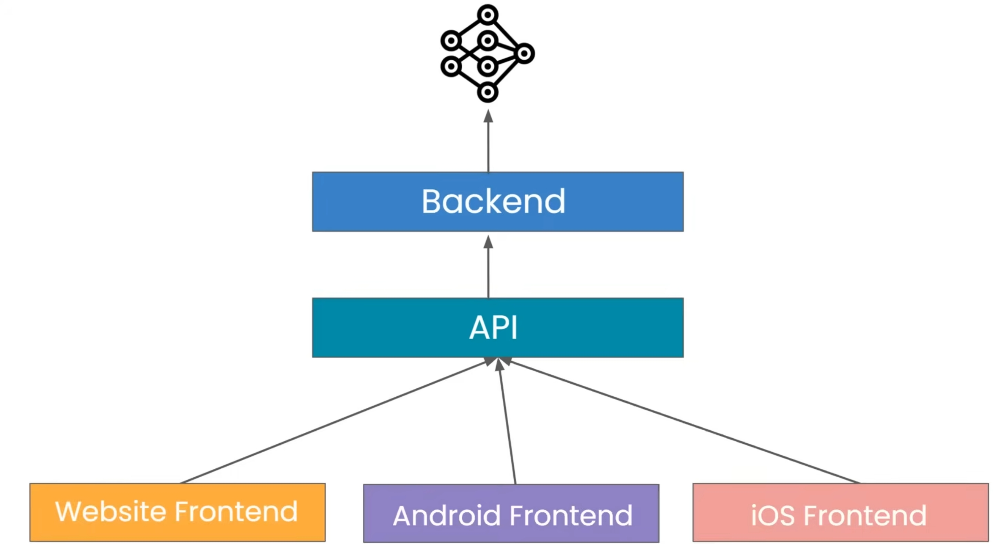
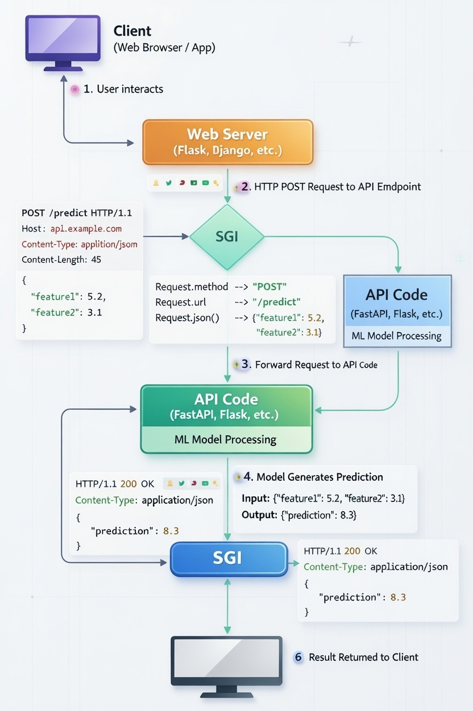
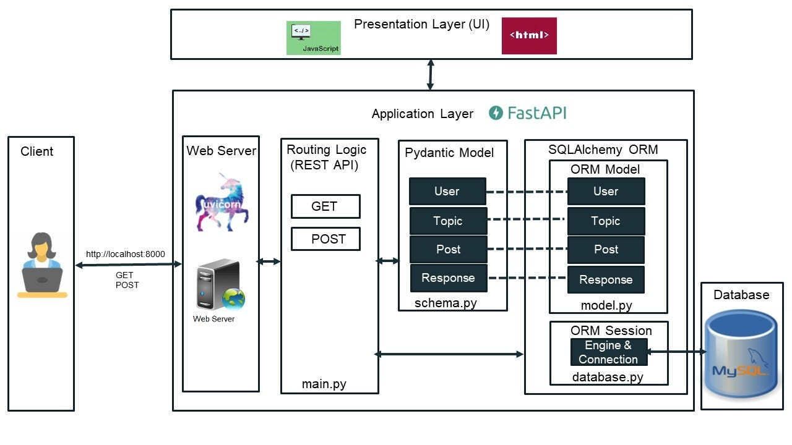

### 📝 FastAPI Project Setup

#### 🛠️ Step 1: Virtual Environment
First, keep your project organized by creating a virtual environment.

> python3 -m venv myenv

#### ⚡ Step 2: Activate the Environment
Turn on your environment so you can install packages.

> source ./myenv/bin/activate

---
### Decorator in Python
```
def my_decorator(func):
    def wrapper():
        print("******************")
        func()
        print("******************")
    return wrapper

@my_decorator
def hello():
    print("Billu")

hello()  
```

`@my_decorator` is the same as saying `a = my_decorator(hello)`, my_decorator returns a function (which is wrapper). Hence call: `a()`

---
### API Overview

<p align="center">
  
</p>

---
### Foundation of APIs

<p align="center">
  
</p>

- **SGI**: SGI stands for *Server Gateway Interface*, a generalized concept describing how web servers and Python applications communicate. 
- The Two Generations of SGI : 
  - **WSGI**: The "Old Reliable" (The Synchronous One) - Werkzeug
  - **ASGI**: The "Speed Demon" (The Asynchronous One) - Starlette

- In Python, we usually group "web servers" into `three main categories`:
  1. SGI Servers (The "Engines") 🏎️: Act as the bridge between the web and your logic
     - **WSGI Servers** (The Classics): `Gunicorn` (most popular one for Django and Flask), `uWSGI` (can do almost anything, but is harder to set up)
     - **ASGI Servers** (The Modern): `Uvicorn` (go-to server for FastAPI, handles "async" tasks perfectly), `Daphne` (Built by the Django team to help Django handle real-time features like chat)
  2. Development Servers (The "Practice" Servers) 🧪
   
     "mini" servers built right into frameworks like Django (`manage.py runserver`) or Flask (`flask run`) - When you are writing code on your own laptop, you usually use a Development Server.
  3. Pure Python HTTP Servers (The "Quick Fix") ⚡
        
        Python comes with a tiny web server built right into the language itself! You can open a terminal in any folder and type: `python -m http.server 8000`

        It instantly turns that folder into a website. It’s great for sharing a file with a friend on the same Wi-Fi, but it can't run complex code like FastAPI. 📂
 
---

### Fast API

<p align="center">
  
</p>

FastAPI is not alone.

It stands on 3 helpers: `Uvicorn  →  Starlette  →  FastAPI  →  Pydantic`

#### 1️⃣ Uvicorn
What it does:
- Starts your server
- Listens on a port (8000)
- Accepts HTTP requests
- Sends responses back
  
🚗 Engine that keeps your app running

#### 2️⃣ Starlette
What Starlette does:
- Routing (`/users`, `/items`)
- Middleware
- Request & Response objects
- Background tasks
- WebSockets

#### 3️⃣ Pydantic
What it does:
- Checks input data
- Converts types
- Ensures data matches your rules

If your app expects a "Price" to be a number, but someone sends the word "Free," Pydantic stops them at the door and says, "Hey, this is wrong!"

---

### async / await

#### 🧠 Normal (synchronous) thinking

> “Do one thing → wait until it finishes → then do the next thing”

#### 🧠 Async thinking
> “Start something → while waiting, do other useful work → come back later”

#### Normal function
```
def hello():
    return "Hello"
```
#### Async function
```
async def hello():
    return "Hello"
```
**⚠️ Important:**
- Calling an async function does NOT run it immediately
- It returns a coroutine object, something like this: `<coroutine object hello at 0x...>
`

So how do we run it?

👉 That’s where `await` comes in.

`await` means:
> “Pause this function here, let others run, and come back when this is done.”

```
async def hello():
    return "Hello"

async def main():
    result = await hello()
    print(result)
```
> A simple rule in Python: You can only use the word `await` inside a function that is defined with `async`.

But how do we start `main()`?

- Python uses an **event loop** to manage async tasks.
- Think of the event loop as: A manager that decides which task runs when.

```
import asyncio

async def main():
    print("Hello async world")

asyncio.run(main())
```

#### Multiple tasks running "together"
```
import asyncio
import time

async def task(name):
    await asyncio.sleep(3)
    print(name)

async def main():
    start = time.time()

    t1 = asyncio.create_task(task("A"))
    t2 = asyncio.create_task(task("B"))

    await t1
    await t2

    print("Time:", time.time() - start)

asyncio.run(main())
```
> `asyncio.gather()`:
- Takes multiple awaitables
- Runs them concurrently
- Waits until all are finished
- Returns their results in order
- Better to use `gather()` instead of sequential `await`
- `gather()` : Concurrent (fast) ✅ 
- If one task fails:
    - Exception is raised
    - Other tasks are cancelled
- Allow failures without cancelling others:
  ```
  results = await asyncio.gather(
    f1(),
    f2(),
    return_exceptions=True)
  ```

> Example 2:
```
import asyncio

async def task(name):
    print(f"{name} started")
    await asyncio.sleep(2)
    print(f"{name} finished")

async def main():
    start = asyncio.get_event_loop().time()

    await asyncio.gather(
        task("Task 1"),
        task("Task 2")
    )

    print("Total time:", asyncio.get_event_loop().time() - start)

asyncio.run(main())
```
---
### Install FastAPI

> pip install fastapi uvicorn pydantic

**A simple Code**
```
from fastapi import FastAPI

app = FastAPI() # Create an object of FastAPI Class

@app.get("/") # get request -> at url "/" 
def sayHello():
    return {"message":"Hello Buddy"}
```

#### To Run
> uvicorn filename:app --reload
